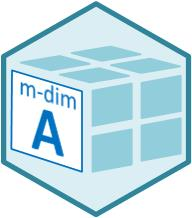

This vignette provides an overview of the R-Package **marray**. This package is a replica of [NumPy](https://numpy.org/){target="_blank"} encoded with base-R, and therefore offers a huge set of functions for an efficient n-dimensional array computing. This functionality can also be found to some extent in [MATLAB](https://de.mathworks.com/help/matlab/matrices-and-arrays.html) and to a lesser extent in [APL](https://bookdown.org/jandeleeuw6/apl/).

{width="68"}

**marray** offers a set of functions for computing with n-dimensional arrays structured as follows:

- creation routines
- manipulation routines
